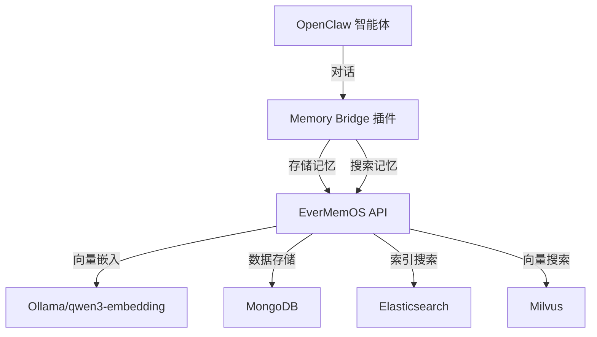

# OpenClaw Memory Bridge

<p align="center">
  
</p>

<h1 align="center">OpenClaw Memory Bridge</h1>

<p align="center">
  <strong>🧠 为你的 OpenClaw 智能体提供持久化记忆系统，实现连续对话</strong>
</p>

<p align="center">
  <a href="#-快速开始">快速开始</a> &bull;
  <a href="#-功能特色">功能特色</a> &bull;
  <a href="#-架构设计">架构设计</a> &bull;
  <a href="#-部署方式">部署方式</a> &bull;
  <a href="docs/">文档</a>
</p>

<p align="center">
  
  
  
  
  
</p>

<p align="center">
  🌐 <strong>多语言:</strong> 
  <a href="README.md">English</a> | 
  <strong>简体中文</strong>
</p>

---

## 🧠 这是什么？

**OpenClaw Memory Bridge** 通过 EverMemOS 集成为你的 OpenClaw 智能体提供持久化记忆。现在你的 AI 可以：

- 💭 **跨会话记忆对话** - 在重启后仍记住之前的对话内容
- 👤 **构建用户画像** - 基于交互和偏好自动建立用户特征
- 🔍 **搜索历史交互** - 使用语义和关键词搜索过往对话
- 📈 **从经验中学习** - 基于历史数据改进回应质量
- 🎯 **预测用户需求** - 根据历史模式预测用户可能的需要

## ⚡ 快速开始

### 前置要求

- **EverMemOS** 本地运行（参见 [EverMemOS 安装指南](docs/evermemos-setup.md)）
- **OpenClaw** 2026.2+
- **Node.js** 20+ 和 npm

### 一键安装

```bash
curl -sSL https://raw.githubusercontent.com/Jackkkkkkkkkkkk123/openclaw-memory-bridge/main/scripts/install.sh | bash
```

### 手动安装

1. **克隆仓库**
   ```bash
   git clone https://github.com/Jackkkkkkkkkkkk123/openclaw-memory-bridge.git
   cd openclaw-memory-bridge
   ```

2. **安装 EverMemOS**（如果尚未运行）
   ```bash
   ./scripts/setup-evermemos.sh
   ```

3. **安装插件**
   ```bash
   ./scripts/install.sh
   ```

4. **配置记忆设置**
   ```bash
   cp .env.example .env
   # 编辑 .env 文件配置你的设置
   ```

5. **重启 OpenClaw Gateway**
   ```bash
   openclaw gateway restart
   ```

## 🎯 功能特色

### 💾 **持久化记忆**
- **跨会话连续性**：在重启后记住用户和上下文
- **长期学习**：在数周和数月内建立理解
- **关系记忆**：跟踪偏好、习惯和沟通风格

### 🔍 **智能搜索**
- **语义搜索**：根据含义而非仅关键词查找相关记忆
- **混合搜索**：结合关键词和向量搜索以获得最佳结果
- **时间感知检索**：适当权衡最近与历史记忆

### 📊 **记忆类型**
| 类型 | 描述 | 使用场景 |
|------|-----|---------|
| **情节记忆** | 对话记忆 | "我们昨天讨论了什么？" |
| **用户画像** | 用户特征 | "记住用户的编程偏好" |
| **前瞻记忆** | 预测模式 | "用户通常在 Y 之后询问 X" |
| **事件日志** | 重要决策 | "跟踪项目里程碑" |

### 🎨 **智能记忆管理**
- **自动提取**：自动识别需要记住的重要信息
- **记忆整合**：合并相关记忆防止重复
- **相关性评分**：优先显示最重要的记忆
- **隐私控制**：按用户和上下文分离记忆

## 🏗️ 架构设计



### 集成流程

1. **自动回忆**：对话开始时注入相关记忆
2. **实时存储**：对话过程中保存重要信息
3. **上下文感知搜索**：基于当前上下文检索记忆
4. **学习循环**：基于记忆洞察改善智能体行为

## 🔧 配置

### 环境变量

创建 `.env` 文件（参考 `.env.example`）：
```bash
# EverMemOS API 端点
EVERMEMOS_API_URL=http://localhost:8001/api/v1

# OpenClaw 用户 ID，用于记忆隔离
OPENCLAW_USER_ID=openclaw

# 记忆搜索设置
DEFAULT_SEARCH_METHOD=hybrid
MAX_MEMORY_RESULTS=10

# 自动回忆设置
ENABLE_AUTO_RECALL=true
AUTO_RECALL_THRESHOLD=0.7
```

### 记忆行为配置

```json
{
  "memorySettings": {
    "autoStore": ["preferences", "decisions", "milestones"],
    "searchMethods": ["hybrid", "vector", "keyword"],
    "retentionDays": 365,
    "maxMemoriesPerQuery": 10
  }
}
```

## 🚀 使用示例

### 基本记忆操作

```typescript
// 存储记忆
await memoryStore({
  content: "用户更偏好 TypeScript 而非 JavaScript 用于新项目",
  sender: "system"
});

// 搜索记忆
const memories = await memorySearch({
  query: "TypeScript 偏好",
  method: "hybrid"
});

// 获取用户画像
const profile = await memoryGet({
  memoryType: "profile"
});
```

### 高级使用模式

```typescript
// 上下文感知的记忆检索
const relevantMemories = await memorySearch({
  query: `${currentTopic} ${userQuestion}`,
  method: "vector",
  topK: 5
});

// 预测用户需求
const predictions = await memoryGet({
  memoryType: "foresight"
});
```

## 🐳 部署

### Docker 部署

```bash
# 启动所有服务
docker-compose up -d

# 检查状态
docker-compose ps
```

### 生产环境设置

参见 [生产环境部署指南](docs/production-deployment.md) 了解：
- 数据库配置
- 备份策略
- 性能调优
- 监控设置

## 🔒 隐私和安全

### 数据隔离
- **用户专属记忆**：每个用户的记忆都是隔离的
- **会话边界**：不同对话之间有清晰的分离
- **加密支持**：敏感记忆的可选加密

### 隐私控制
- **选择性存储**：配置要记住什么类型的信息
- **保留策略**：自动清理旧记忆
- **导出/导入**：用户可以备份或迁移他们的记忆

## 📚 文档

- [EverMemOS 安装](docs/evermemos-setup.md)
- [Memory Bridge API](docs/memory-bridge-api.md)
- [配置指南](docs/configuration.md)
- [故障排除](docs/troubleshooting.md)
- [贡献指南](CONTRIBUTING.md)

## 🧪 开发

### 快速开发设置

```bash
git clone https://github.com/Jackkkkkkkkkkkk123/openclaw-memory-bridge.git
cd openclaw-memory-bridge

# 设置开发环境
npm install
npm run dev

# 运行测试
npm test

# 构建插件
npm run build
```

### 测试记忆功能

```bash
# 测试记忆存储
npm run test:storage

# 测试记忆搜索
npm run test:search

# 集成测试
npm run test:integration
```

## 🤝 贡献

欢迎贡献！请参阅 [CONTRIBUTING.md](CONTRIBUTING.md) 了解指南。

## 📄 许可证

Apache 2.0 许可证。详见 [LICENSE](LICENSE)。

## ⭐ 支持我们

如果这个插件帮助你构建更智能的 OpenClaw 智能体，请给个 star！⭐

---

<p align="center">
  用 🧠 为持久化 AI 记忆而构建
</p>